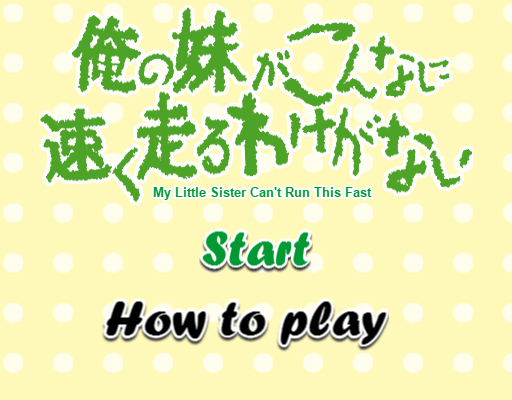
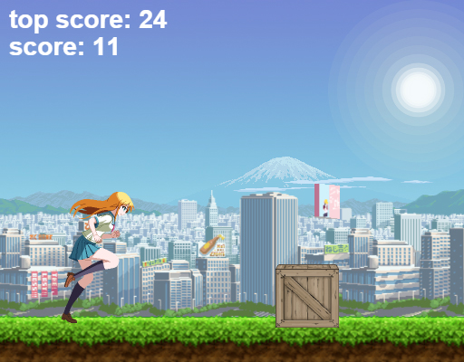

# My Little Sister Can't Run This Fast
## 俺の妹がこんなに速く走るわけがない
#### [PLAY](https://gitcdn.xyz/repo/BrunoHautenfaust/Personal-Projects/master/Oreimo%20Endless%20Runner/MainGame.html)・(￣∀￣)・
#### About the game:
 - This is a fan game(and my first one, by that) called "_My Little Sister Can't Run This Fast_". An endless runner written in JavaScript and Phaser.
 It's based on the anime [**"Ore no Imōto ga Konna ni Kawaii Wake ga Nai"**](http://myanimelist.net/anime/8769/Ore_no_Imouto_ga_Konnani_Kawaii_Wake_ga_Nai)(_"My Little Sister Can't Be This Cute"_) or _"Oreimo"_ for short. 
 - You play as Kirino Kousaka - an avid otaku(pretty much an obsessed anime and manga fan). The goal is simple - collect as many items as you can.
 - Controls: _Mouse_ (or) _Up, Down and Space_ (or) _Tap_
 
#### Screenshots:

#### Browser Performance:
- _Google Chrome 47.0:_ Runs fine!
- _Mozilla Firefox 42.0:_ Runs a bit laggy.
- _Opera 33.0:_ Runs fine!
- _Microsoft Edge:_ No sound. Game doesn't go beyond the main menu. 
- _Internet Explorer 11:_ No sound. Doesn't go beyond the loading screen.

#### Resources:
(This game wouldn't have had the right feeling to it without them)
- Kirino sprites: http://www.justnopoint.com/lbends/
- Background sprites: Waku Waku 7 game
- Various other sprites: http://opengameart.org/content/2d-platformersidescroller-tiles
- Voice SFX: http://mugenguild.com/forum/
- Music - Oreimo Soundtrack: 16 - Suberi-komi no saifu!
